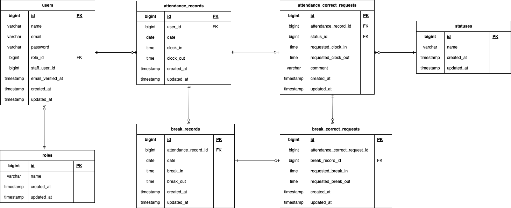

# アプリケーション名

Coachtech　勤怠管理アプリ

## アプリケーション概要

- 一般ユーザ：勤怠情報の登録および一覧、修正の申請が行えます。
- 管理者：全スタッフおよび各勤怠情報の一覧、修正の承認が行えます。

## 使用技術(実行環境)

- PHP 8.1.34
- Laravel 8.83.8
- MySQL 8.0.26
- Docker
- Docker Compose
- phpMyAdmin
- MailHog
- Git
- GitHub

## 環境構築

### 1. リポジトリをクローン

```
git clone https://github.com/Tamori169/Laravel-attendance-management.git
cd Laravel-attendance-management
```

### 2. Dockerコンテナを作成・起動

```
docker-compose up -d --build
```

### 3. PHPコンテナに入る

```
docker-compose exec php bash
```

### 4. Composerパッケージをインストール

```
composer install
```

### 5. .envファイルを作成

```
cp .env.example .env
```

### 6. アプリケーションキーを作成

```
php artisan key:generate
```

### 7. 環境変数の設定

詳細は「環境変数」の項目を参照

### 8. データベースマイグレーション

```
php artisan migrate
```

### 9. シーディング実行

```
php artisan db:seed
```

### "The stream or file could not be opened"エラーが発生した場合

srcディレクトリにあるstorageディレクトリに権限を設定

```
chmod -R 777 storage
```

## 環境変数

`.env.example` をもとに `.env` を作成し、以下の項目を設定してください。

- `APP_KEY`
  - `php artisan key:generate` で生成（「環境構築」項目を参照）
- `DB_HOST=mysql`
- `DB_DATABASE=laravel_db`
- `DB_USERNAME=laravel_user`
- `DB_PASSWORD=laravel_pass`
- `MAIL_FROM_ADDRESS=test@example.com`

## ER図



## URL一覧

作成中（以下URL一覧は参考）

### 1. 認証不要でアクセス可能なページ一覧

- 商品一覧画面(トップ画面)：`http://localhost/`
- 商品詳細画面：`http://localhost/item/{item_id}`
- 会員登録画面：`http://localhost/register`
- ログイン画面：`http://localhost/login`

### 2. 認証後にアクセス可能なページ一覧

- メール認証誘導画面： `http://localhost/email/verify`
- プロフィール設定画面： `http://localhost/setup-profile`
- 商品購入画面： `http://localhost/purchase/{item_id}`
- 送付先住所変更画面： `http://localhost/purchase/address/{item_id}`
- プロフィール画面： `http://localhost/mypage`
- プロフィール編集画面： `http://localhost/mypage/profile`
- 商品出品画面： `http://localhost/sell`

### 3. DB管理画面

- phpMyAdmin：`http://localhost:8080`

## MailHog設定

本アプリではメール認証機能の確認に MailHog を使用しています。  
Docker起動後、MailHog は `http://localhost:8025` で確認が可能です。

`.env` への設定内容は下記の通りです。

```env
MAIL_MAILER=smtp
MAIL_HOST=mailhog
MAIL_PORT=1025
MAIL_FROM_ADDRESS=test@example.com
MAIL_FROM_NAME="${APP_NAME}"
```

## 機能テスト実行手順

`config/database.php` にはテスト用DB接続設定を記述済みです。  
以下の手順でテスト用DBと環境ファイルを作成後、テストを実行してください。

### 1. MySQLにログイン

```
cd Laravel-attendance-management
docker-compose exec mysql bash
```

### 2. rootにアクセス

```
mysql -u root -p
パスワードは `root` を入力してください。
```

### 3. テスト用DBを作成

```
CREATE DATABASE laravel_attendance_management_test;
exit
```

### 4. .env.testingを作成

```
docker-compose exec php bash
cp .env .env.testing
```

### 5. 環境変数設定

```.env.testing
APP_ENV=testing
DB_DATABASE=laravel_attendance_management_test
DB_USERNAME=root
DB_PASSWORD=root
```

### 6. 設定キャッシュをクリア

```
php artisan config:clear
php artisan cache:clear
```

### 7. データベースマイグレーション

```
php artisan migrate --env=testing
```

### 8. テスト実行

```
php artisan test
```

## テストユーザー

### 1. ユーザー情報一覧

シーディングにより、下記３名の動作確認用テストユーザーが作成されます。  
各ユーザーの認証状況および権限は下記の通りです。  
また、各ユーザーに応じた想定用途も記載しているので、それぞれ動作確認に活用してください。

テストユーザー1：メール認証済み

- ユーザ名：田中太郎
- メールアドレス：tanaka@example.com
- パスワード：tanakatanaka
- 権限：一般ユーザ
- 想定用途：ログイン後の各機能動作確認

テストユーザー2：メール認証未済

- ユーザ名：佐藤次郎
- メールアドレス：sato@example.com
- パスワード：satosato
- 権限：あああ
